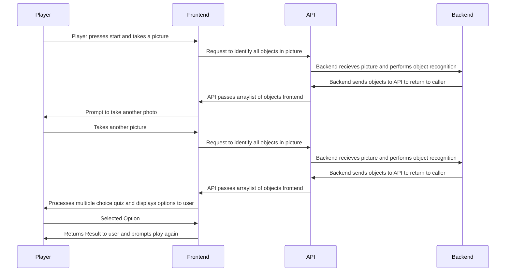
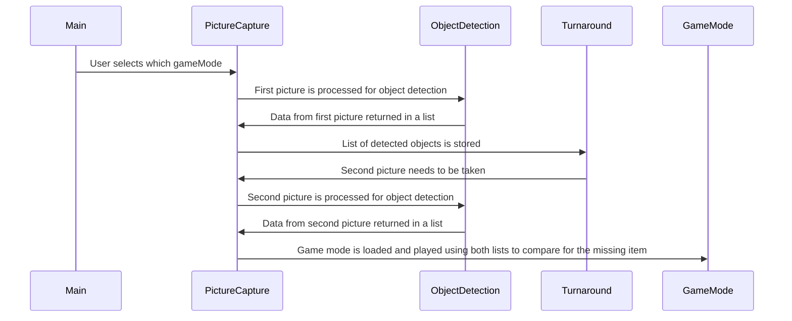
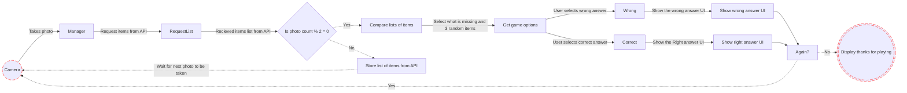
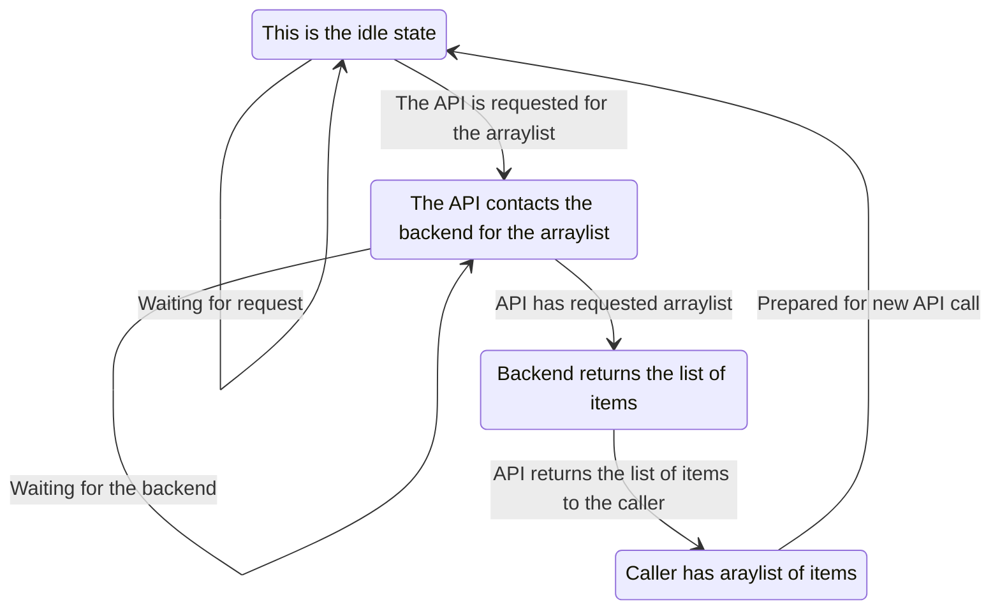
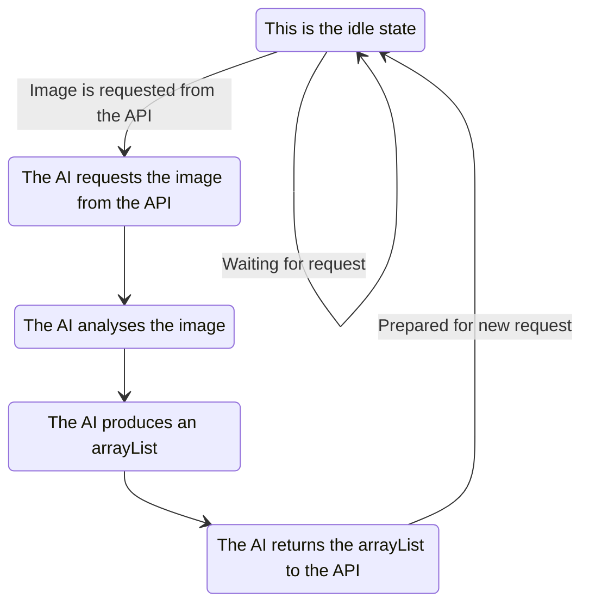
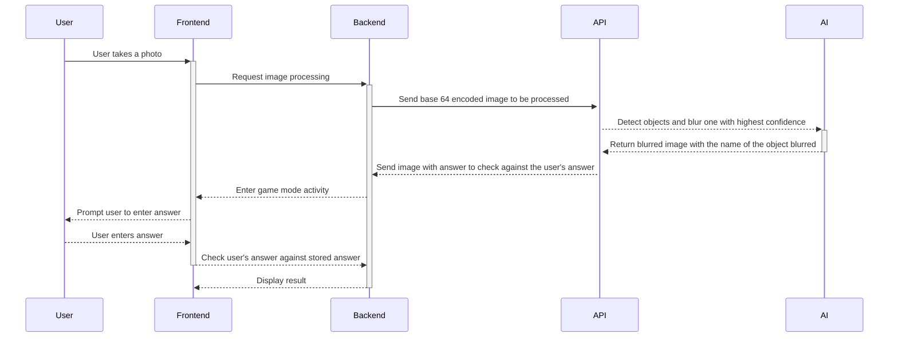

# Flowcharts and Sequence Diagrams
## App Sequence diagram

## Frontend

## API

#### The API
The API is hosted on aws and utilises AWS serverless technology.
To access the API we use an AWS API Gateway with an endpoint `getItemsFromImage` set to open.
Setting this endpoint to open means that anyone is able to access the endpoint without setting up a vpc.
This endpoint is also set up as regional to use the region which is closest to the UK for lowest latency.

#### The Lambda

This endpoint calls an AWS Lambda to run what it is needed to run.
An AWS Lambda is the serverless technology previously talked about. Imagine an AWS Lambda as a server which
only runs when it is needed to run. This results in a very cheap alternative to running a server.
The AWS Lambda that we are running uses python. This python Lambda calls the method Lambda Handler. 
This is where the code will start to be run. It is passed in an event and the context of the event.
Depending on the action you can return from the lambda a body and a status code or just a status code.
The body is a json string of data often times seen as the result. The status code is an identifier which can
result in a quick classification of the content, if the status code is 200 it was a success,
if the status code was a 401 it was unauthorized, etc.

#### Status Code Cheatsheet

For more info on the status codes which will be used, use this. https://restfulapi.net/http-status-codes/

### State Diagram

## Backend

```mermaid
flowchart LR
    APICall((API)) 
        -->|Request objects from picture| ObjCall[[Recieve objects\nrequest from API]]
        -->|Prepare image for AI| PreAI[Prepare for AI]
        -->|Request objects from AI| AIRequest[Request objects list from AI]
        .->|Revieve objects from AI| AIRecieve[Recieved objects list from AI]
        -->|Gives API the list to send to the frontend| APISend((Send to API))
        
    style APICall stroke:#f66,stroke-width:2px,stroke-dasharray: 10 5
    style APISend stroke:#f66,stroke-width:2px,stroke-dasharray: 10 5
```

## AI

